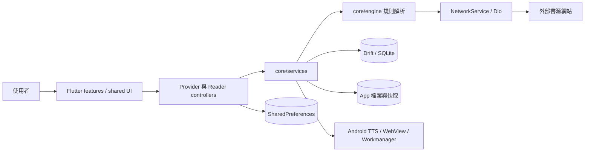
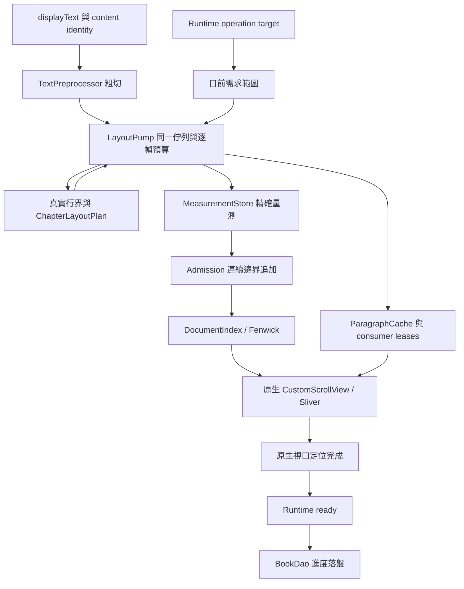

# 夜讀 Night Reader — 系統架構

夜讀是一個以 Flutter 實作的 Android 閱讀器。App 本身擁有 UI、規則解析、閱讀排版與所有持久狀態；網路書源網站只在執行時提供搜尋、目錄與正文，專案沒有自有後端服務。

## 系統概觀

`lib/main.dart` 是程序入口，先建立 Flutter binding、錯誤處理與原生 splash，再由 `configureDependencies()` 註冊資料庫、DAO、網路與服務。`ReaderApp` 建立全域 Provider 與 Material app，`MainPage` 提供書架、發現與個人設定三個主要入口。

## 關鍵流程

### 書源搜尋與取文

搜尋／書籍詳情／書架 Provider 負責取得與保存 metadata；搜尋結果進 `SearchBookDao`，書籍與章節 metadata 進各自 DAO。正文不由搜尋層保存，而由 `ReaderChapterContentStorage / Store` 統一管理持久正文；`WebBook` 與規則引擎只負責從外部書源取得與解析資料，HTTP 經 `NetworkService` / Dio。

需要登入或互動驗證的流程可使用 WebView。批次書源校驗走專用 isolate 並關閉互動式 WebView，以免背景工作要求 UI。

### 閱讀

`BookOpenRoute` 建立 Reader V2 頁面，`ReaderV2Runtime` 管理開書、跳章、樣式切換與錯誤狀態。章節 repository 依序使用本機內容、持久快取或書源網路取得正文，再套用替換規則與繁簡轉換。

粗切位置不是排版邊界。`LayoutPump` 在真實視覺行首建立可獨立排版的 transaction，保留自然段的縮排、段距與末行補償。切行 probe 與 Paragraph 建置共用同一佇列、需求取消與 frame credit；拖曳只改預算，不撤銷有效內容。

`ChapterLayoutPlan` 保存不含正文的切分資訊，保證原始文字被逐出後，重新載入仍使用已進入文件的相同 BlockKey／文字範圍。原始文字或 Paragraph 的 LRU eviction 不會自行刪除 active `DocumentIndex` 幾何；明確跳章、排版世代或 Runtime 發布的 content generation 變更才重建文件。持久正文若在 session 外被下載/更新，ChapterRepository 在重新取得該章時比較已 materialize identity 並推進 committed generation；Hybrid 不從 plan mismatch 反向命令 Runtime reload，同一 generation 內若 identity 不一致就是 invariant failure。已訪問文件的量測與切分資訊會隨範圍累積，並非全書常數記憶體。

可見 render object、視口準備與命令各自持有 `ParagraphLease`。快取替換／逐出只釋放快取的引用，不能提前 dispose 仍被消費者使用的 native Paragraph。`ReaderV2Location` 是跨層位置契約，包含章節、UTF-16 字元位移、視覺位移及內容重映射資訊；章內進度以完整正文長度為分母，不依賴目前排完多少高度。

換源由 `SourceSwitchService` 準備新 source world，先驗證目標正文，再以 download quiesce + database transaction 做 atomic handoff；成功後 Reader 以 replacement route 建立新 session。候選書源/network/rule unavailable 可作為產品失敗或跳過候選；transaction、invariant 與未知程式錯誤不得被當成「來源不可用」吞掉。

### 背景工作

Workmanager 的 `callbackDispatcher()` 在另一個 isolate 執行，會重新呼叫 `configureDependencies()`，再讀取書架並執行背景任務。前景啟動不會初始化 Workmanager，目前程式碼也沒有註冊週期或一次性工作；callback 仍保留作為背景契約。任何新增背景路徑都必須假設 DI 與記憶體單例不會跨 isolate 共用。

## 資料與狀態歸屬

| 狀態 | 真相來源 | 主要入口 |
|---|---|---|
| 書籍、書源、章節 metadata、書籤、下載、Cookie | Drift / SQLite | `lib/core/database/` 與各 DAO |
| 持久正文 | Drift / `ReaderChapterContents` | `ReaderChapterContentStorage`、`ReaderChapterContentStore` |
| 封面與衍生檔案資產 | App 私有檔案系統 | `BookCoverStorageService` 等 storage service |
| Reader raw-text residency | HybridChapterRepository window | Reader session 內的 bounded raw residency |
| Layout metrics / Paragraph reuse | MeasurementStore / MetricsDiskCache / ParagraphCache | 各自 namespace、epoch 與 consumer lease；生命週期不同，不合併 |
| 使用者偏好與主題模式 | `SharedPreferences` | `PreferKey`、`SettingsProvider`、`ThemeSettingsProvider` |
| Reader 命令、可見位置、semantic content generation、持久化 | 各自的 runtime operation／content session／viewport／progress owner | `ReaderV2Runtime`、`ReaderV2State`、`ReaderV2Location` |
| Active 文件幾何與切分 | DocumentIndex／ChapterLayoutPlan | Hybrid screen 的明確文件重建 |
| 可繪段落存活期 | 每個 consumer 的 ParagraphLease | RenderCachedBlock／視口／命令 |
| 書源規則與解析結果 | 書源資料 + 記憶體／持久快取 | `core/engine`、`WebBook`、書源服務 |

資料表或 DAO 變更需要同步 Drift 生成碼與 schema migration。影響 Model 或 Reader 預設值的偏好設定需要同步 `SettingsProvider`、`AppConfig` 與 `PreferKey`。

## 外部系統

- 書源網站：提供搜尋、詳情、目錄與正文，格式、登入、反爬與可用性不受 App 控制。
- Android WebView：處理互動登入或驗證流程。
- Android TTS 與媒體服務：提供朗讀、語音選擇與媒體通知。
- Android Workmanager：執行背景書架任務。
- GitHub Actions：建置並發布簽章 APK。

## 部署

目前發布目標是 Android `arm64-v8a`。`.github/workflows/android-release.yml` 在 `v*` tag 時建置簽章 APK 並發布 GitHub Release；手動 `workflow_dispatch` 只建置測試 artifact。標準發布順序與檢查以根目錄 `AGENTS.md` 為準。
