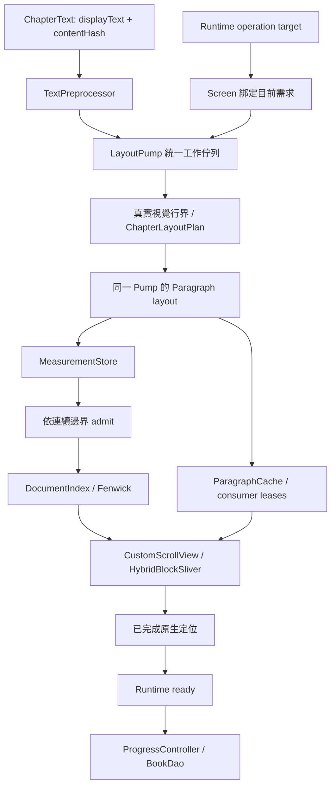

# 閱讀器 (reader)

## Responsibility

擁有夜讀的正文會話、內容轉換、閱讀位置與呈現。`ReaderV2Runtime` 管理命令和狀態，`HybridReaderScreen` 組裝既有 Hybrid B 的 Flutter Sliver／Paragraph 管線。沒有另建 Reader V3；未掛載 Hybrid viewport 時的分頁 resolver／navigation 路徑仍保留。

2026-09-18 的核心責任分工如下；先前考古判定保存在 `docs/changes/planning/2026-09-18-hybrid-b-rebuild/`，不是現行程式規格。

| 責任 | Owner | 核心入口 |
|---|---|---|
| 命令目標、操作身分、ready／error | Runtime／StateMachine | `session/reader_v2_runtime.dart`、`reader_v2_state_machine.dart`、`reader_v2_operation_token.dart` |
| displayText、轉換與 content identity | ChapterRepository／Content | `chapter/reader_v2_chapter_repository.dart`、`reader_v2_content.dart`、`reader_v2_content_transformer.dart` |
| 位置重映射、保存 | ContentLocationMapper／ViewportBridge／ProgressController | `session/reader_v2_location.dart`、`reader_v2_viewport_bridge.dart`、`reader_v2_progress_controller.dart` |
| 切行 probe、drawable layout、pending／去重／取消、frame credit | LayoutPump | `hybrid/pump/layout_pump.dart`、`budget_governor.dart`、`layout_cost_model.dart` |
| Active 文件的精確幾何與切分 | DocumentIndex／ChapterLayoutPlan | `hybrid/measure/document_index.dart`、`hybrid/core/chapter_layout_plan.dart` |
| drawable 存活 | 實際 consumer 的 ParagraphLease | `hybrid/paragraph/paragraph_cache.dart`、`hybrid/view/cached_block_widget.dart` |
| 連續邊界追加 | AdmissionController | `hybrid/view/admission_controller.dart` |
| 捲動、慣性、viewport geometry | Flutter 原生 ScrollPosition／Sliver | `hybrid/view/hybrid_scroll_view.dart`、`hybrid_block_sliver.dart` |
| 原始文字的常駐範圍 | HybridChapterRepository | `hybrid/text/hybrid_chapter_repository.dart` |

除另註外，表中路徑相對於 `lib/features/reader_v2/`。

## Scope

頁面裝配在 `screen/reader_v2_page.dart`、`reader_v2_page_shell.dart`、`reader_v2_controller_host.dart` 與 `screen/dependencies/reader_v2_dependencies.dart`。`BookOpenRoute` 是開書入口，controller host 以 viewport／style 建立 layout spec；既有 `DESIGN.md`、共享 `AppBottomSheet`／`AppStateView` 仍是 UI 慣例。

會話核心在 `session/`：`ReaderV2State` 表達 cold／loading／layingOut／restoring／ready／switchingMode／error；`ReaderV2OperationToken` 的 targetLocation 是正在執行的語意目標。`ReaderV2Resolver`、`ReaderV2NavigationController`、`ReaderV2PreloadScheduler` 的分頁支線不是 Hybrid Paragraph queue，不應同時驅動兩個 viewport。

內容 repository 封裝本地書、持久快取、書源服務，以及替換規則、CJK typography normalization、繁簡轉換。`contentHash` 綁定最終 displayText，`contentGeneration` 使 TTS 淘汰舊 segment／highlight。`ReaderV2ContentLocationMapper` 使用 canonical-equivalent 轉換或雙側 text context 重映射 UTF-16 位置。

閱讀功能仍由 `features/menu/`、`settings/`、`tts/`、`auto_page/`、`bookmark/`、`replace_rule/` 與 `use_cases/reader_v2_page_coordinator.dart` 管理。朗讀跟隨、頁距移動經 `ReaderV2ViewportController` 七閉包；settleScroll 直達，其餘命令由 Hybrid FIFO 執行，綁定當時 runtime／pump／操作身分，失效後不套用到新視口。

`layout/reader_v2_layout_spec.dart`、`reader_v2_style.dart`、`reader_v2_typography.dart` 保存樣式、em-grid 與字寬契約。`render/` 與 `layout/reader_v2_layout_engine.dart` 的既有分頁型別與引擎保留。

## Data flow

`_ensureChapterBlocks` 取得及粗切正文後，將 visual-line alignment 排入 Pump；不在 screen 的 async continuation 直接做 native probes。`_ChapterWork` 每次推進一個切行步驟，與 `_LayoutWork` 共用目前 frame credit。`pumpPending()` 不會因反覆 await 而取得新的每幀預算。`setDemandRange` 同時撤銷過期切行與 drawable 工作，取消的 preparation Future 會完成而不懸掛。

`_requestWindow` 先為所需內容持有 leases，再提交工作；既有 exact metrics／drawable 可立即重用。`BlockReady` 只沿 center 前後的連續邊界進入 DocumentIndex；不再要求 block 位於 visible／cacheExtent 以外。6000／3000px 只作前後預載距離，不是首屏 restore 成功條件，更不改使用者的手勢或慣性位移。

`_restoreCore` 完成目標與實際首屏材料化後，等待原生視口存在並套用 scroll offset，才回覆成功。Runtime 隨後完成 ready／保存；被阻塞的遠端預載或背景 queue 尚有工作，不會讓已定位的首屏失敗。

## State-transition contracts

**命令意圖與畫面觀察：**遠距離跳章開始時，既有 `ReaderV2OperationToken` 就接管目標需求範圍，不等正文下載完成。舊畫面 capture 不得在命令 pending 時把需求拉回原章。沒有另造 restore ticket 或 user-scroll-observed barrier。

**樣式／旋轉：**host 以有效 layout spec 呼叫 `applyPresentation`，runtime 更新 layoutGeneration 並保留語意位置；screen 更換 pump／namespace，撤销舊命令與準備結果，清理 active 幾何與切分，重新定位。換色不改幾何指紋，重建 drawable 時仍由 leases 保證原生物件壽命。

**內容轉換：**`reloadContentPreservingLocation` 保留原內容以重映射 offset，清 content cache 並更新世代，再以新 content identity 定位。切分身分包含實際 charRange／continuation／layoutBreakBefore；只有相同 chapter、hash、textLength 的 `ChapterLayoutPlan` 可以重新材料化正文。

**快取逐出：**raw eviction 只釋放 `_blocks` 與無效 in-flight 入口，不刪已 admit 幾何或 text-free plan。載入完成時若章節已不屬目前 residency，結果可回覆原呼叫者但不重新占住 raw cache。回讀已訪問章節復用舊 plan，不能用新成本估計重新解釋舊 BlockKey。若內容身分真的改變，改走內容重載及 anchor 重映射，不混用旧座標。

**Paragraph 存活：**cache、每個 mounted RenderCachedBlock、視口準備與命令都各自擁有引用。LRU 淘汰或同 key replacement 先取得新引用、再釋放舊引用；只有最後一個 owner 釋放時才 dispose。畫面訂閱 replacement 持續到 detach，不依赖一次性 waiter 或 restore pin timing。

**換源／離場：**先 flush 取得權威位置，再 resolve／原子 persist；退出 sheet 後替換 reader route，建立新會話。返回與 App lifecycle 經既有 exit coordinator／ProgressController 落盤。TTS、閱讀時間、規則 I/O 的真實狀態沒有因 Hybrid 瘦身而刪除。

## Boundaries

- `ReaderV2Location` 是跨層位置契約；content metadata 不替代 chapter／offset／visualOffset 的座標語意。全章進度由 charOffset／完整 displayText.length 得到。
- native Sliver 幾何查詢仍使用140成熟化的增量 Fenwick。itemExtent callback 必須是全函式，保留已證明需要的1px fallback；它不提供 scrollExtent，也不是全書估高。
- 任意 char cut 不可增加硬換行。獨立 transaction 只在實際行界，lookahead 維持 wrapping，縮排只屬語意段首，段距及 B2 只屬真正段尾。
- gesture 只影響 Pump 的資源分配；dragging 仍可取得有界切片。不要恢復 dragging 零供給、lead friction、restore-prefetch barrier、screen `_enqueued` 或 discard rollback 帳本。
- tiny style-keyed `measureCellWidth` 仍是同步字寬探針；不要將「正文切行與 Paragraph 工作共用 queue」誇大為所有任何尺寸的 native 量測都已非同步化。
- Active 幾何／切分 metadata 隨已訪問範圍累積，直到明確文件重建；raw cache 與 drawable reuse 有自己的界限，不能把後兩者有界說成整個會話常數記憶體。

## Validation entrypoints

`flutter analyze`、`flutter test` 是基本檢查。聚焦測試在 `test/features/reader_v2/hybrid/`：`hybrid_pump_test.dart` 驗證統一 queue／frame credit／取消與 leases；`cached_block_repaint_test.dart` 驗證 mounted consumer 壽命；`chapter_layout_plan_test.dart`、`hybrid_chapter_residency_test.dart` 驗證身分與逐出；`hybrid_measure_test.dart`、`hybrid_scroll_behavior_test.dart` 驗證連續追加及原生 motion；`hybrid_reader_screen_test.dart` 驗證定位、pending target、阻塞預載與跨章往返。

`hybrid_visual_layout_segmentation_test.dart`、`hybrid_visual_layout_compensation_test.dart`、`em_grid_lock_test.dart` 保留行界、末行補償、字寬基線。`reader_v2_style_change_test.dart`、`reader_v2_rotation_viewport_test.dart`、`reader_v2_chinese_convert_loop_test.dart`、`reader_v2_source_switch_loop_test.dart` 及 core source-switch tests 保留跨模組契約。

`.github/workflows/reader-v2.yml` 檢查實際 checkout 的 committed source，不注入補丁；Android lane 執行 `integration_test/reader_journey_test.dart` 並保存 screenshot／logcat。host tests 不是裝置效能證據；120Hz／P99／特定手機的主張需要另有實測。

## Known limits

網路失敗仍可能使尚未取得的正文不可顯示；移除 readiness 人為阻礙不等於能顯示不存在的資料。單一 visual line 若超過目標 transaction 字數，不能為硬切預算而破壞行界。未取得內容身分的相鄰同名、不同 URL 章節不再被通用 title-only 規則刪除；相同 URL 去重仍保留，不宣稱解決所有畸形來源的跨 URL 重複。

## Related modules

App 裝配見 `app_shell.md`，章節／正文來源見 `engine.md`、`source_network.md`，資料與交易見 `data.md`，書籍入口見 `library.md`，發布與平台運作見 `operations.md`。本次實作與證據見 `../changes/completed/2026-09-18/hybrid-b-rebuild.md`。
