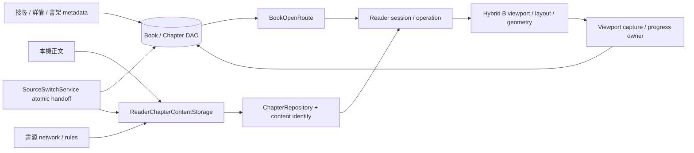

# 閱讀器 (reader)

## Responsibility

Night Reader 目前只有一套正文呈現架構：Hybrid B。 `ReaderV2Runtime` 擁有命令意圖與會話狀態，`HybridReaderScreen` 擁有目前 viewport；正文排版只走 `ReaderV2LayoutSpec → ReaderV2TextLayoutFrame → VisualLineLayoutEngine → LayoutPump / ReaderParagraphLayout → ChapterLayoutPlan → DocumentIndex → Flutter Sliver`。不存在第二套分頁 resolver、paged render model 或未掛載 Hybrid 時的 compatibility path。

| 責任 | Owner | 核心入口 |
|---|---|---|
| 搜尋結果與書籍/章節 metadata | Search / BookDetail / Bookshelf + DAO | `features/search`、`features/book_detail`、`features/bookshelf` |
| 持久正文 | ReaderChapterContentStorage / Store | `core/services/reader_chapter_content_storage.dart`、`reader_chapter_content_store.dart` |
| source owner atomic handoff | SourceSwitchService + SourceSwitchOperationLease | `core/services/source_switch_service.dart`、`source_switch_handoff.dart` |
| Reader lifecycle（cold / ready / unavailable） | Runtime / StateMachine | `session/reader_v2_state.dart`、`reader_v2_state_machine.dart` |
| 命令目標、operation identity、normal cancellation、pending layout intent | StateMachine / OperationToken | `session/reader_v2_state_machine.dart`、`reader_v2_operation_token.dart` |
| displayText、內容轉換、committed content identity | ChapterRepository / Content | `chapter/reader_v2_chapter_repository.dart`、`reader_v2_content.dart`、`reader_v2_content_transformer.dart` |
| semantic content generation 發布 | Runtime / StateMachine | `session/reader_v2_runtime.dart`、`reader_v2_state.dart`、`reader_v2_state_machine.dart` |
| 語意位置重映射與落盤 | ContentLocationMapper / ViewportBridge / ProgressController | `session/reader_v2_location.dart`、`reader_v2_viewport_bridge.dart`、`reader_v2_progress_controller.dart` |
| 正文實體可用寬度 | ReaderV2LayoutSpec | `layout/reader_v2_layout_spec.dart` |
| visual-line break policy | VisualLineLayoutEngine | `hybrid/layout/visual_line_layout_engine.dart` |
| native shaping / drawable Paragraph | ReaderParagraphLayout | `hybrid/layout/reader_paragraph_layout.dart` |
| pending 去重/取消、frame credit | LayoutPump | `hybrid/pump/layout_pump.dart`、`budget_governor.dart`、`layout_cost_model.dart` |
| Active 文件精確幾何與切分 | DocumentIndex / ChapterLayoutPlan | `hybrid/measure/document_index.dart`、`hybrid/core/chapter_layout_plan.dart` |
| Paragraph 存活 | consumer-owned ParagraphLease | `hybrid/paragraph/paragraph_cache.dart`、`hybrid/view/cached_block_widget.dart` |
| 連續邊界追加 | AdmissionController | `hybrid/view/admission_controller.dart` |
| 捲動、慣性、viewport geometry | Flutter ScrollPosition / Sliver | `hybrid/view/hybrid_scroll_view.dart`、`hybrid_block_sliver.dart` |
| 原始文字 residency | HybridChapterRepository | `hybrid/text/hybrid_chapter_repository.dart` |

## Full-chain ownership



`ReaderChapterContentStorage` 的 static in-flight ledger 與 `ChapterContentPreparationPipeline` 的 instance in-flight ledger 不是重複 cache：前者跨 storage instance 合併同一持久正文請求，後者只在單一 materializer 內合併 fetch/retry。兩者的 `reset` 只使 ledger 不再重用既有工作，不代表取消底層 Future。

## Failure model

- 外部 source/network/storage unavailable 可以轉成明確產品結果；候選換源失敗只淘汰該候選。
- operation superseded / dispose / generation change 依既有 operation 與 generation ownership 處理，不改寫成 unavailable。
- database transaction、layout/geometry/content invariant 與未知程式錯誤保留 root cause，不由 Reader UI / source-switch sheet 的 catch-all 改寫成普通失敗。
- persisted anchor JSON 損壞是外部資料，可退回 scalar progress；其他程式錯誤不走 compatibility fallback。

## Data flow

```mermaid
flowchart TD
    Command[Runtime semantic target] --> Demand[Hybrid viewport demand]
    Content[displayText + contentHash] --> Pre[TextPreprocessor]
    Width[ReaderV2LayoutSpec physical width] --> Frame[ReaderV2TextLayoutFrame centered drawable width]\n    Frame --> Lines[VisualLineLayoutEngine]
    Pre --> Lines
    Lines --> Pump[LayoutPump scheduler]
    Demand --> Pump
    Lines --> Plan[ChapterLayoutPlan]
    Pump --> Shape[ReaderParagraphLayout]
    Shape --> Metrics[MeasurementStore]
    Shape --> Paragraphs[ParagraphCache + leases]
    Metrics --> Admission[AdmissionController]
    Admission --> Index[DocumentIndex]
    Index --> Sliver[CustomScrollView / HybridBlockSliver]
    Paragraphs --> Sliver
    Sliver --> Capture[Viewport location]
    Capture --> Runtime[Runtime stable world / progress]
```

## Current invariants

- Reader lifecycle 只回答「是否已有可閱讀的 stable world」：首次 world 尚未建立是 `cold`，已建立是 `ready`，只有首次連可閱讀 world 都無法建立時才是 `unavailable`。
- Runtime operation token 表示真正要完成的語意目標；jump / restore / presentation / content reload 都是 operation。新 operation 取代舊 operation 是正常 cancellation，舊 async completion 不得覆寫新 operation 或 stable world。
- 外部目標正文 unavailable 由 ChapterRepository 的明確失敗型別表示；已有 stable world 時只結束該 operation 並保留舊 world，不能升格成 Reader unavailable。內部 viewport/layout invariant violation 則直接暴露為 bug，不轉成產品 failure state。
- `ReaderV2Location` 是跨層位置契約。內容 identity 改變時由 `ReaderV2ContentLocationMapper` 重映射，不以舊 scalar offset 猜位置。
- ChapterRepository 擁有已 materialize 章節的 content identity：成功 explicit reload，或同一 session 重新取得某章時確認 identity 已被外部持久層更新，才推進 committed `contentGeneration`。內部 cache/work generation 可為淘汰 stale async 而獨立前進，失敗 rollback 不改變 committed content generation。
- Runtime 將 committed `contentGeneration` 發布到 session state。若無 operation 時重新取得的目前可見章節 identity 改變，Runtime 會先用 `ReaderV2Location` 的 content anchor 對新正文重映射 visible location，再發布 generation。Hybrid / TTS 只消費 Runtime state，不直接觀察 repository 內部 generation；content reload 不冒充 layout change，因此不推進 `layoutGeneration`。
- Hybrid 文件 epoch 綁定 `layoutGeneration + contentGeneration`。任一 generation 變更都由上層發布後單向重建；若 generation 在既有 Runtime operation 的 viewport transaction 期間前進，Runtime 保留同一 operation token，於新 generation 重新 resolve 同一 semantic target 後再 restore，不建立替代 operation。若當下沒有 operation，Hybrid 直接以已發布的 visible location 本地重建。若 `ChapterLayoutPlan` 在同一 generation 內遇到 content identity mismatch，視為 invariant failure。
- `ReaderV2LayoutSpec.contentWidth` 只代表 viewport 扣除使用者 padding 後的實體可畫寬度；cell / em-grid typography metric 不得縮小或重定義它。
- `ReaderV2TextLayoutFrame` 擁有 physical content frame 內的正文水平放置：以實測全形 advance 推導可容納的整數 cell 寬度，殘差左右平分；visual-line planning、drawable Paragraph、實際 block padding 與 TTS overlay 必須共用同一 frame。它不得修改使用者 padding 或 viewport-owned `contentWidth`。
- `VisualLineLayoutEngine` 是唯一 visual-line break owner：native grapheme geometry 決定內容是否放得下，native Unicode word boundary 只提供英文／混排的優先斷點；標點類別沒有否決一個仍然放得下的 grapheme 的權力，也不讀取 SkParagraph soft-wrap line boundary。單一英文詞本身超過整行時才退回 grapheme boundary。
- `ReaderParagraphLayout` 只擁有 shaping 與 drawable Paragraph mechanism。reader-owned 行界以 layout-only hard break 呈現，source text 不插入換行；`ParagraphTextMap` 負責 layout offset 與 UTF-16 source offset 的雙向映射。
- `LayoutPump` 只排程 line planning / drawable work、pending 去重/取消與 frame credit；若 native Paragraph 在 reader-owned 行界之外再次 soft-wrap，直接視為 layout invariant violation，不建立 fallback 或標點特判。
- `DocumentIndex` 只接收連續、已精確量測的 block；active geometry 不由 raw cache eviction 反向刪除。
- Paragraph 的生命週期由實際 consumer lease 擁有；cache eviction 不能 dispose 仍被 mounted widget 或 command 使用的 Paragraph。
- native scroll position 是捲動與慣性的 owner。排版 readiness 不修改手勢位移或 ballistic trajectory。
- 6000/3000px 是前後材料化距離，不是 restore barrier，也不是 admission gate。
- `HybridScrollView` 的 1px item-extent fallback 只滿足 Flutter callback 必須為全函式的契約；真正 scroll geometry 仍由 DocumentIndex / Fenwick 決定。
- 換色可以重建 drawable；會改幾何的 style/viewport 變更會換 layout generation 並重新材料化目前語意位置。
- source switch / app lifecycle /離場先由 viewport capture 取得權威位置，再交給 progress owner 落盤。

## UX animations

目前 Reader 沒有為舊 restore、補排版或 loading latency 存在的 AnimationController/Ticker infrastructure。保留的動畫是產品互動本身：

- page-distance / TTS ensure-visible 使用原生 `ScrollPosition.animateTo`；
- menu/settings 的 `AnimatedSlide` / `AnimatedContainer` 屬於目前 UI transition。

這些動畫不是排版或 restore correctness 的 owner。

## Validation

自動 correctness 只保留 owner-level contract：

```bash
flutter test \
  test/features/reader_v2/reader_v2_state_machine_test.dart \
  test/features/reader_v2/reader_v2_runtime_operation_test.dart \
  test/features/reader_v2/hybrid/hybrid_pump_test.dart \
  test/core/services/source_switch_service_test.dart
```

- `reader_v2_state_machine_test.dart`：lifecycle / operation state、content identity、anchor migration。
- `reader_v2_runtime_operation_test.dart`：operation ownership、supersede/cancellation、stable-world 發布。
- `hybrid_pump_test.dart`：queue/frame budget、Paragraph ownership、DocumentIndex fuzz、measurement、continuous paragraph geometry。
- `source_switch_service_test.dart`：prepare → validate → commit、rollback 與 source ownership handoff。

不再以 Widget debug snapshot、page-level test injection 或 test-only timing hook驗證 Reader。若測試需要穿透 UI private state，代表責任邊界放錯位置；測試應改到真正 owner，而不是在 production 新增觀測 API。

觸控、動畫、捲動流暢度、跳章等待與實際閱讀體感由正常 debug App 在實體裝置／需要時 AVD 做 smoke；自動測試不能取代真人 UX 驗收。
