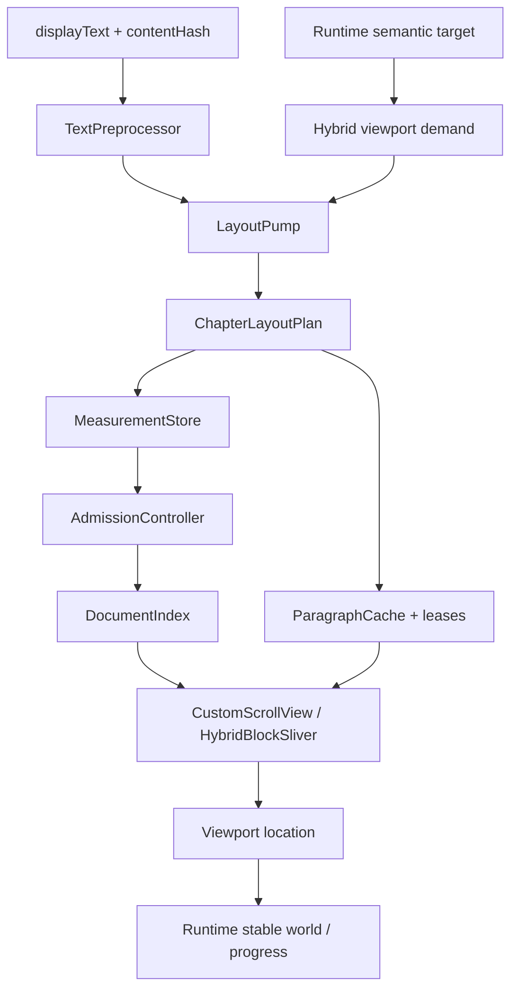

# 閱讀器 (reader)

## Responsibility

Night Reader 目前只有一套正文呈現架構：Hybrid B。 `ReaderV2Runtime` 擁有命令意圖與會話狀態，`HybridReaderScreen` 擁有目前 viewport，正文排版與幾何只走 `LayoutPump → ChapterLayoutPlan → DocumentIndex → Flutter Sliver`。不存在第二套分頁 resolver、paged render model 或未掛載 Hybrid 時的 compatibility path。

| 責任 | Owner | 核心入口 |
|---|---|---|
| Reader lifecycle（cold / ready / unavailable） | Runtime / StateMachine | `session/reader_v2_state.dart`、`reader_v2_state_machine.dart` |
| 命令目標、operation identity、normal cancellation、pending layout intent | StateMachine / OperationToken | `session/reader_v2_state_machine.dart`、`reader_v2_operation_token.dart` |
| displayText、內容轉換、committed content identity | ChapterRepository / Content | `chapter/reader_v2_chapter_repository.dart`、`reader_v2_content.dart`、`reader_v2_content_transformer.dart` |
| semantic content generation 發布 | Runtime / StateMachine | `session/reader_v2_runtime.dart`、`reader_v2_state.dart`、`reader_v2_state_machine.dart` |
| 語意位置重映射與落盤 | ContentLocationMapper / ViewportBridge / ProgressController | `session/reader_v2_location.dart`、`reader_v2_viewport_bridge.dart`、`reader_v2_progress_controller.dart` |
| 切行、Paragraph layout、pending 去重/取消、frame credit | LayoutPump | `hybrid/pump/layout_pump.dart`、`budget_governor.dart`、`layout_cost_model.dart` |
| Active 文件精確幾何與切分 | DocumentIndex / ChapterLayoutPlan | `hybrid/measure/document_index.dart`、`hybrid/core/chapter_layout_plan.dart` |
| Paragraph 存活 | consumer-owned ParagraphLease | `hybrid/paragraph/paragraph_cache.dart`、`hybrid/view/cached_block_widget.dart` |
| 連續邊界追加 | AdmissionController | `hybrid/view/admission_controller.dart` |
| 捲動、慣性、viewport geometry | Flutter ScrollPosition / Sliver | `hybrid/view/hybrid_scroll_view.dart`、`hybrid_block_sliver.dart` |
| 原始文字 residency | HybridChapterRepository | `hybrid/text/hybrid_chapter_repository.dart` |

## Data flow



## Current invariants

- Reader lifecycle 只回答「是否已有可閱讀的 stable world」：首次 world 尚未建立是 `cold`，已建立是 `ready`，只有首次連可閱讀 world 都無法建立時才是 `unavailable`。
- Runtime operation token 表示真正要完成的語意目標；jump / restore / presentation / content reload 都是 operation。新 operation 取代舊 operation 是正常 cancellation，舊 async completion 不得覆寫新 operation 或 stable world。
- 外部目標正文 unavailable 由 ChapterRepository 的明確失敗型別表示；已有 stable world 時只結束該 operation 並保留舊 world，不能升格成 Reader unavailable。內部 viewport/layout invariant violation 則直接暴露為 bug，不轉成產品 failure state。
- `ReaderV2Location` 是跨層位置契約。內容 identity 改變時由 `ReaderV2ContentLocationMapper` 重映射，不以舊 scalar offset 猜位置。
- ChapterRepository 擁有已 materialize 章節的 content identity：成功 explicit reload，或同一 session 重新取得某章時確認 identity 已被外部持久層更新，才推進 committed `contentGeneration`。內部 cache/work generation 可為淘汰 stale async 而獨立前進，失敗 rollback 不改變 committed content generation。
- Runtime 將 committed `contentGeneration` 發布到 session state。若無 operation 時重新取得的目前可見章節 identity 改變，Runtime 會先用 `ReaderV2Location` 的 content anchor 對新正文重映射 visible location，再發布 generation。Hybrid / TTS 只消費 Runtime state，不直接觀察 repository 內部 generation；content reload 不冒充 layout change，因此不推進 `layoutGeneration`。
- Hybrid 文件 epoch 綁定 `layoutGeneration + contentGeneration`。任一 generation 變更都由上層發布後單向重建；若 generation 在既有 Runtime operation 的 viewport transaction 期間前進，Runtime 保留同一 operation token，於新 generation 重新 resolve 同一 semantic target 後再 restore，不建立替代 operation。若當下沒有 operation，Hybrid 直接以已發布的 visible location 本地重建。若 `ChapterLayoutPlan` 在同一 generation 內遇到 content identity mismatch，視為 invariant failure。
- 正文 visual-line probe 與 drawable Paragraph 都由同一 `LayoutPump` 排程；`BudgetGovernor` 只負責目前 frame 可消耗的工作量。
- `DocumentIndex` 只接收連續、已精確量測的 block；active geometry 不由 raw cache eviction 反向刪除。
- Paragraph 的生命週期由實際 consumer lease 擁有；cache eviction 不能 dispose 仍被 mounted widget 或 command 使用的 Paragraph。
- native scroll position 是捲動與慣性的 owner。排版 readiness 不修改手勢位移或 ballistic trajectory。
- 6000/3000px 是前後材料化距離，不是 restore barrier，也不是 admission gate。
- `HybridScrollView` 的 1px item-extent fallback 只滿足 Flutter callback 必須為全函式的契約；真正 scroll geometry 仍由 DocumentIndex / Fenwick 決定。
- 換色可以重建 drawable；會改幾何的 style/viewport 變更會換 layout generation 並重新材料化目前語意位置。
- source switch / app lifecycle /離場先由 viewport capture 取得權威位置，再交給 progress owner 落盤。

## UX animations

目前 Reader 沒有為舊 restore、補排版或 loading latency 存在的 AnimationController/Ticker infrastructure。保留的動畫是產品互動本身：

- page-distance / TTS ensure-visible 使用原生 `ScrollPosition.animateTo`；
- menu/settings 的 `AnimatedSlide` / `AnimatedContainer` 屬於目前 UI transition。

這些動畫不是排版或 restore correctness 的 owner。

## Validation

基本入口：

```bash
flutter analyze
flutter test test/features/reader_v2
flutter test test/core/services/source_switch_service_test.dart test/core/services/source_switch_progress_test.dart test/core/engine/reader/chinese_text_converter_length_test.dart
```

重點 correctness coverage：

- `hybrid_reader_screen_test.dart`：定位、pending semantic target、材料化、跨章往返與 viewport correctness。
- `hybrid_pump_test.dart`：共用 queue、frame credit、取消與 Paragraph leases。
- `chapter_layout_plan_test.dart`、`hybrid_chapter_residency_test.dart`：layout identity、plan reuse 與 raw residency。
- `hybrid_visual_layout_segmentation_test.dart`、`hybrid_visual_layout_compensation_test.dart`、`em_grid_lock_test.dart`：行界、末行補償與 typography。
- `reader_v2_runtime_operation_test.dart`、`reader_v2_state_machine_test.dart`：operation ownership。
- style、rotation、簡繁轉換、source-switch tests：跨模組位置與 identity 契約。

`.github/workflows/reader-v2.yml` 在 GitHub Actions 只跑 analyze 與 Reader/source-switch tests。Android emulator journey 不再是 PR gate；觸控、動畫、流暢度與實際閱讀體感由人類在實體裝置或需要時的 AVD 驗收，不能用自動 journey 代替真人 UX 判斷。
